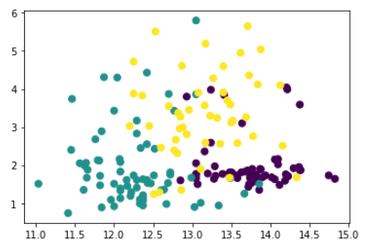
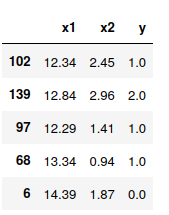
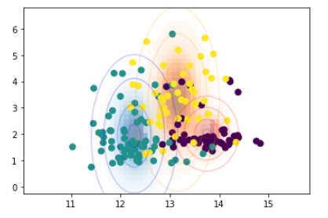

```{r setup, include=FALSE}
knitr::opts_chunk$set(echo = FALSE)
```

## Naive Bayes

Naive Bayes is a **classifier**. This model can help us decide the **category** of an observation given some input/predictor data about that observation. 

Example: Is this tweet a positive review of our company? Or a negative one?

Our [example](https://archive.ics.uci.edu/ml/datasets/Wine): tell me what the *cultivar* of this wine is, given 13 chemical measurements on it.

## Visualizing the Data

```{r, echo=FALSE, out.width="100%", fig.cap=""}

```


## Visualizing Smaller Data

```{r, echo=FALSE, out.width="60%", fig.cap=""}

```

```{r, echo=FALSE, out.width="20%", fig.cap=""}

```


## Writing Down the Model


$$
P(y \mid x_1, \dots, x_p) = \frac{P(y) P(x_1, \dots, x_p \mid y)}
                                 {P(x_1, \dots, x_p)} 
$$

- $y \in \{0,1,2\}$ the category/label of one observation/row
- $x_j$ the value of predictor $j \in \{1,\ldots,p\}$ for our one observation/row
- $p$: the number of predictors is (13 for us, or 2 if we're thinking of the baby data)


## Why is this model "Naive?"

In
$$
P(y \mid x_1, \dots, x_p) = \frac{P(y) P(x_1, \dots, x_p \mid y)}
                                 {P(x_1, \dots, x_p)} 
$$

we assume **conditional independence** of the predictors:

$$
P( x_1, \dots, x_p \mid y) = P( x_1 \mid y) P( x_2 \mid y)  \cdots  P( x_p \mid y)
$$

## Checking the Naivete 


```
# checking conditional independence
df[df.y == 0].drop(['y'], axis=1).corr()
#df[df.y == 1].drop(['y'], axis=1).corr()
#df[df.y == 2].drop(['y'], axis=1).corr()
```


## Picking the Predictor Distribution

**Gaussian** Naive Bayes is popular if your predictors are numerical. 

$$
P(x_i \mid y) = \frac{1}{\sqrt{2\pi\sigma^2_{i,y}}} \exp\left(-\frac{(x_i - \mu_{i,y})^2}{2\sigma^2_{i,y} }\right)
$$

Multinomial ( Bernoulli and categorical) NB is (are) popular for categorical predictors.

## Checking (conditional) normality

```
# check normality
df[df.y==0].drop(['y'], axis=1).hist()
#df[df.y==1].drop(['y'], axis=1).hist()
#df[df.y==2].drop(['y'], axis=1).hist()
```
```{r, echo=FALSE, out.width="75%", fig.cap=""}

```

## Fitting the Model (1 of 3)

Fitting is done with **maximum likelihood estimation**. The likelihood for one row of data is

$$
P_{\color{red}{\theta}}(y, x_1, \dots, x_p) = P_{\color{red}{\theta}}(y) P_{\color{red}{\theta}}(x_1, \dots, x_p \mid y)
$$
where $\theta$ is the collection of all model parameters.


## Fitting the Model (1 of 3)

Fitting is done with **maximum likelihood estimation**. The likelihood for one row of data is

$$
P_{\color{red}{\theta}}(y, x_1, \dots, x_p) = P_{\color{red}{\theta}}(y) P_{\color{red}{\theta}}(x_1, \dots, x_p \mid y)
$$
or

$$
P_{\theta}(y_i, x_{i,1}, \dots, x_{i,p}) = P_{\theta}(y_i) P_{\theta}(x_{i,1}, \dots, x_{i,p} \mid y_i)
$$

where $i=1,\ldots,n$ for $n$ rows of data. 


## Fitting the Model (1 of 3)

Fitting is done with **maximum likelihood estimation**. The likelihood for one row of data is

$$
P_{\color{red}{\theta}}(y, x_1, \dots, x_p) = P_{\color{red}{\theta}}(y) P_{\color{red}{\theta}}(x_1, \dots, x_p \mid y)
$$
or

$$
P_{\theta}(y_i, x_{i,1}, \dots, x_{i,p}) = P_{\theta}(y_i) P_{\theta}(x_{i,1}, \dots, x_{i,p} \mid y_i)
$$

where $i=1,\ldots,n$ for $n$ rows of data. 

The **likelihood function** is 
$$
L(\theta) = \prod_{i=1}^{n} P_{\theta}(y_i) P_{\theta}(x_{i,1}, \dots, x_{i,p} \mid y_i)
$$

Pick parameters that maximize the function.


## Fitting the Model (2 of 3)


$$
\prod_{i=1}^{n} P_{\theta}(y_i) P_{\theta}(x_{i,1}, \dots, x_{i,p} \mid y_i) = \underbrace{\prod_{i=1}^{n} P_{\theta}(y_i)}_{\text{(1)}} \underbrace{ \prod_{i=1}^{n} \prod_{j=1}^{p} P_{\theta}(x_{i,j}\mid y_i)}_{\text{(2)}}
$$
Estimating (1) is done with calculus. The estimates turn out to be empirical proportions of labels. 

```
gnb = GaussianNB()
estimated_model = gnb.fit(X,y)
estimated_model.class_prior_
```
```{r, echo=FALSE, out.width="75%", fig.cap=""}
knitr::include_graphics("pics/label_props.png")
```

## Fitting the Model (3 of 3)


$$
\prod_{i=1}^{n} P_{\theta}(y_i) P_{\theta}(x_{i,1}, \dots, x_{i,p} \mid y_i) = \underbrace{\prod_{i=1}^{n} P_{\theta}(y_i)}_{\text{(1)}} \underbrace{ \prod_{i=1}^{n} \prod_{j=1}^{p} P_{\theta}(x_{i,j}\mid y_i)}_{\text{(2)}}
$$

Estimating (2) is done with calculus, too. We need to estimate a mean and variance for each label/predictor pair.

```
gnb = GaussianNB()
estimated_model = gnb.fit(X,y)
estimated_model.theta_ # mean params
estimated_model.sigma_ # std. dev. params
```

## Prediction

Once we have parameter estimates, we can predict on **out-of-sample** data--predict new labels $y'$ from new observations $(x_1',\ldots,x_p')$


$$
P(y' \mid x_1', \dots, x_p') = \frac{P(y') P(x'_1, \dots, x'_p \mid y')}
                                 {P(x'_1, \dots, x'_p)}
$$

## Prediction

Once we have parameter estimates, we can predict on **out-of-sample** data--predict new labels $y'$ from new observations $(x_1',\ldots,x_p')$


$$
P(y' \mid x_1', \dots, x_p') = \frac{P(y') P(x'_1, \dots, x'_p \mid y')}
                                 {P(x'_1, \dots, x'_p)}
$$

```{r, out.width="50%", fig.cap=""}

```

## Prediction


$$
\begin{align}
y'_{\text{pred}} &= \arg\max_y \frac{P(y') P(x'_1, \dots, x'_p \mid y)}
                                 {P(x'_1, \dots, x'_p)} \\
                &= \arg\max_{y} P(y)P(x'_1, \dots, x'_p \mid y)
\end{align}
$$
```
y_pred = estimated_model.predict(X_new)
```

```{r, out.width="50%", fig.cap=""}

```


## Prediction

To assess prediction accuracy, we need to compare predictions versus reality. This should only be done with out-of-sample data. Choices:

1. wait for a lot of new data, 
2. split the data once into training and testing sets, or
3. use cross-validation (many two-way splits)


```
X_train, X_test, y_train, y_test = train_test_split(X, y, test_size=0.5)
y_pred = GaussianNB().fit(X_train, y_train).predict(X_test)
```

## On Misspecification, Overfitting and Computational Scaling

### Tweaking 

- too few/many predictors?
- wrong predictors? (feature engineering)
- add conditional dependence (LDA and QDA) and/or parameter sharing 

### Scaling

- closed-form and recursive formulas for parameter estimates
- evaluating $P(y') P(x'_1, \dots, x'_p \mid y')$ is trivial
- semi-supervised learning


## Materials

Download the materials from here: 

[https://github.com/tbrown122387/naive_bayes/](https://github.com/tbrown122387/naive_bayes/)

